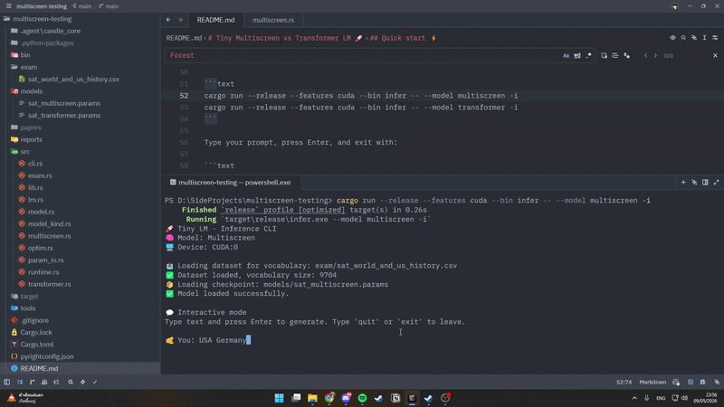
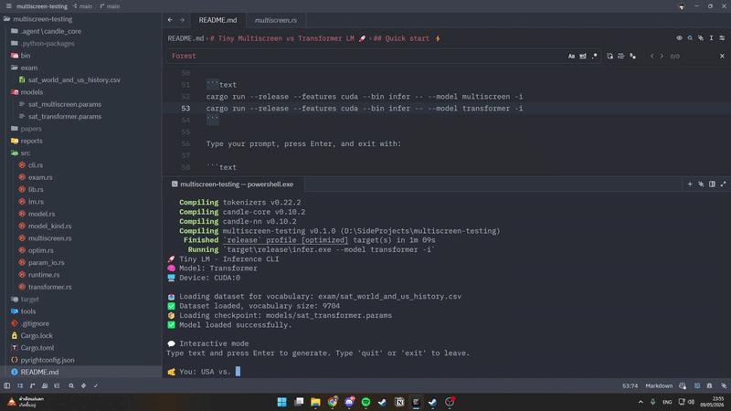
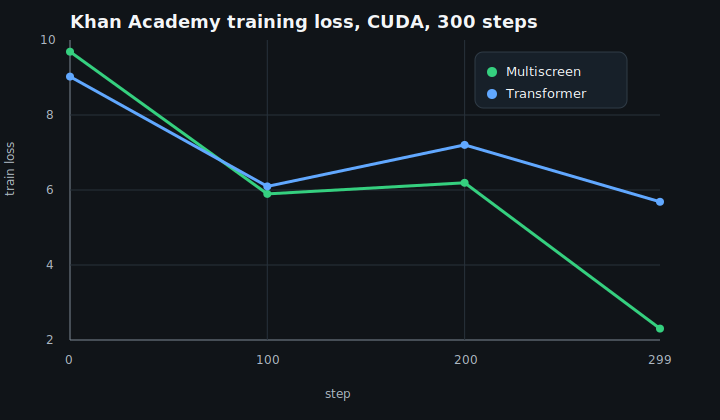

# Tiny Multiscreen vs Transformer LM 🚀

| Multiscreen demo | Transformer demo |
| --- | --- |
|  |  |

Tiny Rust/Candle playground for comparing two causal language models on the same SAT-style next-token task.

- 🌀 **Multiscreen** lives in `src/multiscreen.rs`
- ⚡ **Transformer** lives in `src/transformer.rs`
- 🧩 `src/model.rs` is only a backwards-compatible shim for old `crate::model::*` imports
- 🔒 The models do **not** share checkpoint files
- 📚 Paper PDFs are **not committed** and are not needed to build or run this repo

## Quick start ⚡

PowerShell CUDA one-liners:

```powershell
cmd /S /C "set CUDA_COMPUTE_CAP=89 && call ""C:\Program Files\Microsoft Visual Studio\2022\Community\VC\Auxiliary\Build\vcvars64.bat"" && set MULTISCREEN_DEVICE=cuda && cargo run --release --features cuda --bin train -- --model multiscreen --steps 1000"
cmd /S /C "set CUDA_COMPUTE_CAP=89 && call ""C:\Program Files\Microsoft Visual Studio\2022\Community\VC\Auxiliary\Build\vcvars64.bat"" && set MULTISCREEN_DEVICE=cuda && cargo run --release --features cuda --bin train -- --model transformer --steps 1000"
```

If emoji output looks cursed in PowerShell, run this once in the same terminal:

```powershell
[Console]::OutputEncoding = [System.Text.UTF8Encoding]::new()
$OutputEncoding = [System.Text.UTF8Encoding]::new()
```

PowerShell chat:

```powershell
cmd /S /C "set CUDA_COMPUTE_CAP=89 && call ""C:\Program Files\Microsoft Visual Studio\2022\Community\VC\Auxiliary\Build\vcvars64.bat"" && set MULTISCREEN_DEVICE=cuda && cargo run --release --features cuda --bin infer -- --model multiscreen -i"
cmd /S /C "set CUDA_COMPUTE_CAP=89 && call ""C:\Program Files\Microsoft Visual Studio\2022\Community\VC\Auxiliary\Build\vcvars64.bat"" && set MULTISCREEN_DEVICE=cuda && cargo run --release --features cuda --bin infer -- --model transformer -i"
```

CMD setup, if you are inside `cmd.exe` or a Developer Command Prompt:

```text
set CUDA_COMPUTE_CAP=89
call "C:\Program Files\Microsoft Visual Studio\2022\Community\VC\Auxiliary\Build\vcvars64.bat"
set MULTISCREEN_DEVICE=cuda
```

Then CMD train:

```text
cargo run --release --features cuda --bin train -- --model multiscreen --steps 1000
cargo run --release --features cuda --bin train -- --model transformer --steps 1000
```

Then CMD chat:

```text
cargo run --release --features cuda --bin infer -- --model multiscreen -i
cargo run --release --features cuda --bin infer -- --model transformer -i
```

Type your prompt, press Enter, and exit with:

```text
quit
```

Quick sanity/test command:

```text
cargo test
```

Benchmark command:

```text
cargo run --release --features cuda --bin compare -- --steps 1000
```

## Training Machine 🖥️

| Part | Spec |
| --- | --- |
| CPU | AMD Ryzen 5 5600X 6-Core Processor, 12 logical threads |
| GPU | NVIDIA GeForce RTX 4070, 12,282 MiB VRAM |
| Memory | 31.92 GiB RAM |

## Model Files 🔐

No shared-params nonsense. Each model has its own checkpoint and magic header.

| Model | Checkpoint | Header | Params |
| --- | --- | --- | ---: |
| Multiscreen | `models/sat_multiscreen.params` | `MSCRP001` | 686,618 |
| Transformer | `models/sat_transformer.params` | `TRFMP001` | 720,514 |

Wrong combo gets blocked:

```text
Error: invalid checkpoint magic for transformer: expected TRFMP001, found MSCRP001
```

## Loss Plot 📉

Latest CUDA comparison loss curve:



Raw plotted points:

```text
reports/loss_points.csv
```

## Benchmark Snapshot 🏁

Same dataset, tokenizer, objective, optimizer, CUDA device, `1000` steps.

| Model | Train loss | Val acc | Test acc | Avg inference |
| --- | ---: | ---: | ---: | ---: |
| Multiscreen | 3.7590 | 21.31% | 21.38% | 19.651 ms |
| Transformer | 4.6138 | 21.81% | 22.57% | 5.709 ms |

Vibe check:

- 🌀 Multiscreen fits train harder.
- ⚡ Transformer is faster and slightly better on test accuracy here.
- 🧪 Metrics are next-token LM metrics, not multiple-choice exam accuracy.
- 🧯 Multiscreen v1 is dense and correctness-first, not fused-kernel wizardry yet.

## Data 🧠

Dataset:

```text
exam/sat_world_and_us_history.csv
```

Split:

| Split | Examples | Tokens |
| --- | ---: | ---: |
| Train | 966 | 57,292 |
| Validation | 207 | 15,711 |
| Test | 207 | 13,557 |

Tokenizer:

```text
word-level + simple punctuation split
vocab_size = 9,704
```

Special tokens:

| Token | ID |
| --- | ---: |
| `<PAD>` | 0 |
| `<UNK>` | 1 |
| `<BOS>` | 2 |
| `<EOS>` | 3 |
| `<SEP>` | 4 |

## Model Layers 🧱

Multiscreen:

| # | Block | Shape | Params | Note |
| ---: | --- | --- | ---: | --- |
| 1 | Token embedding + scales | token ids -> `[B, T, 64]` | 621,058 | embedding is row-normalized |
| 2 | Multiscreen layer 1 | `[B, T, 64]` -> `[B, T, 64]` | 32,780 | 4 gated screening tiles |
| 3 | Multiscreen layer 2 | `[B, T, 64]` -> `[B, T, 64]` | 32,780 | 4 gated screening tiles |
| 4 | Tied logits head | `[B, T, 64]` -> `[B, T, 9704]` | 0 extra | reuses token embedding |
| - | Total | - | 686,618 | - |

Transformer:

| # | Block | Shape | Params | Note |
| ---: | --- | --- | ---: | --- |
| 1 | Token embedding + positions + scales | token ids -> `[B, T, 64]` | 621,058 | positions are sinusoidal, no params |
| 2 | Transformer layer 1 | `[B, T, 64]` -> `[B, T, 64]` | 49,728 | 4-head attention + FFN + LayerNorm |
| 3 | Transformer layer 2 | `[B, T, 64]` -> `[B, T, 64]` | 49,728 | 4-head attention + FFN + LayerNorm |
| 4 | Tied logits head | `[B, T, 64]` -> `[B, T, 9704]` | 0 extra | reuses token embedding |
| - | Total | - | 720,514 | - |

Layer comparison:

| Compare | Multiscreen | Transformer |
| --- | --- | --- |
| Core layer | 4 gated screening tiles | masked self-attention + FFN |
| Token mixing | Trim-and-Square relevance + causal softmask | scaled dot-product attention + causal softmax |
| Uses softmax inside layer | No | Yes |
| Uses LayerNorm | No | Yes, 2 per layer |
| FFN block | No separate FFN | Yes, `64 -> 256 -> 64` |
| Params per layer | 32,780 | 49,728 |
| Total params | 686,618 | 720,514 |
| Latest train loss | 3.7590 | 4.6138 |
| Latest test accuracy | 21.38% | 22.57% |
| Latest avg inference | 19.651 ms | 5.709 ms |

## References 📚
- Screening Is Enough: https://arxiv.org/pdf/2604.01178
- Attention Is All You Need: https://arxiv.org/pdf/1706.03762
- SAT Questions and Answers for LLM: https://www.kaggle.com/datasets/trainingdatapro/sat-history-questions-and-answers
